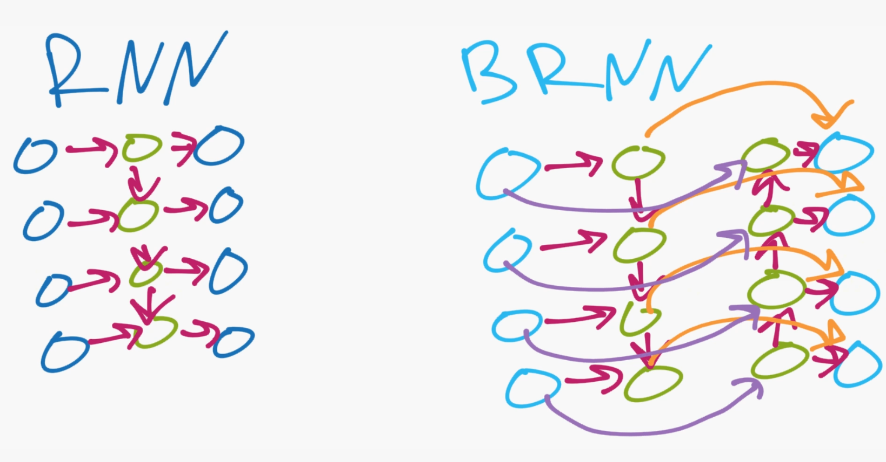

# Mina
A quirky chatbot

**By: Analeidi Barerra and Corey Pieper**

## Introduction

Chatbots are a prominent topic within AI which draw on natural language processing, natural language generation, and deep learning. They're application ranges from virtual assistants such as Siri and Alexa to commercial use such as the automated chats you find on websites. For our project, we built a chatbot in TensorFlow using deep learning. To create the chatbot, we focused on a type of model called sequence-to-sequence (seq2seq) models. One of the most successful applications of seq2seq models was for the task of Neural Machine Translation (NMT), or translating between languages using neural networks. However, to apply neural networks to natural language, we first need to find a way to turn words into numbers. A NMT program does this by taking in input text and feeding it through an encoder, which converts it into a "thought" vector that represents the text's meaning. That vector is then passed through a decoder to give a translation.


*source: Luong, Bravado, Zhao https://github.com/tensorflow/nmt*

If you think about it, any model that we can use for translation can also be used in a chatbot. By pairing responses together, we train the model to recognize conversational patterns and assosciate inputs with certain outputs. In some ways creating a chatbot is even harder than translation. When translating between languages there is usually only a few correct translations, but when it comes to conversation, there could be hundreds or thousands of possible ways to respond.

## Data

In order to train our chatbot, we need lots of paired response data (e.g. questions and answers). To generate this data, we looked to the popular online forum, Reddit. There is a website called <pushshift.io> that archives all the comments posted on Reddit and allows you to download them by time period, which gave us the data we needed. Now, there are millions of comments that get posted to Reddit everyday and not all of them are very useful. Because we wanted to train the chatbot on good data, we filtered comments to only include those which have a score of at least three (to get better quality comments) and were an acceptable length. In addition, the comments do not list the parent comment they are replying to but only the id of the parent comment, so we have to search for the text of the parent comment. In order to efficiently run the data cleaning process, we inserted the comments into a database as we read through the original text file.

Later, we decided we wanted to combine the Reddit comments with more data to create a more robust chatbot. The [Cornell Movie Dialog Corpus](https://www.cs.cornell.edu/~cristian/Cornell_Movie-Dialogs_Corpus.html) is a collection of conversations from movie scripts which is commonly used to train many chatbots. While the Reddit comments provided interesting responses, the movie dialog was more polished. We opted to use 150,000 reply pairs from each source.


## Models

### BRNN
The first type of seq2seq model we tried using were Bidirectional Recurrent Neural Networks (BRNN). BRNNs are useful when dealing with sequential data because not only is it using LSTMs to do well with longer inputs, but it also allows you to take into consideration the previous, current, and future words. They differ from traditional RNNs in that regular RNNs can only consider previous words, but BRNNs can look both behind and forward (hence the name bidirectional). However, this architecture proves to be very time consuming, given that when working with one million data pairs, three epochs were done in 90 minutes. This is due to the fact that in RNNs information is fed in sequentially, as the output of the current node depends on the previous node (see image below).



*source: Sentdex*

### Transformer Model
The second seq2seq model that we used was a transformer model. Unlike the BRNN that has to take each word at a time, a transformer uses parallelization and takes in all the words at once, which makes it significantly faster. This transformer's architecture takes in the comment/question as an input (bottom left), the reponse as an output (bottom right), which in reality can be thought about as another input, and finally outputs a probability of what the next response word should be.  
    

*From Vaswani et al. in ‘Attention Is All You Need’*  

This architecture has an encoder and decoder, which makes it ideal for translation. In this case though, we are "translating" from a comment/question to a response.  
 

*From Vaswani et al. in ‘Attention Is All You Need’*  

- Input
To make the comment or question understandable and informative to the model, each word is tokenized and transformed into a number. 
 

 Even more interestingly, each word that has a close relationship with another will have similar tokens. The embedding space refers to how the tokens will be saved physically closer to each other if they are close in meaning. The following is not from our model but does a good job at demonstrating what embedding space is. 
   
 
 *Anzor Gozalishvili https://www.anz2.blog/nlp/relations-in-bert-embedding-space/*

 After the input embedding, each word goes through a positional encoding which looks specifically to where the word is positioned at in the phrase and thus provides additional context. 

 

*By Matthew Barnett*

- Encoder

The comment/question is now ready for the encoder! The encoder has two layers: the attention layer and the feed forward layer.

- Multi-Head Attention Layer

The attention model looks at how important each word is in relation to the other words. Hence each word will have its own vector and because it is a multi-head attention layer, it will get an average vector of its importance. 

- Feed Forward

The feed forward layer changes the form of the attention layer, so that it is acceptable for the coming encoding or decoding block.
 
- Decoder

Before entering the decoder block, the answer (not the comment/question) goes through the same embedding as the input layer where the words are tokenized and then are given a postional encoding. Once it reaches the decoder, it will go through a masked multi-head attention layer, a normal multi-head attention layer, and a feed forward layer. 

- Masked Multi-Head Attention

The answer goes through the same procedure as the multi-head attention that the comment/question went through, but at this point, the model uses both the answer attention vector and the comment/question attention vector to see what words from the answer relate to that of the comment/question. The reason that there is masking is because the decoder wants to predict what will be the next word in the answer. It can use the previous and current word from the answer as well as all the comment/question words but not the actual answer word. The multi-head attention is similar to this layer but without the masking, and the feed forward layer does the same thing as it did with the encoder. 


### Final Product
To try interacting with Mina yourself, checkout [this Colab notebook](https://colab.research.google.com/drive/18yMHrAgpTHai9qKG_PARiB625PSlZ8Et?usp=sharing) and follow the instructions at the top for getting the files and connecting to your Google drive. You do not have to train the model as it is using the weights we already obtained and stored. At the bottom of the notebook you can interact with Mina like so:

```predict("How are you doing?")```

### Conclusion
Our chatbot, Mina, is still far from perfect. It deviates from the topic and also repeats several phrases within the response. One option for getting better overall responses is to generate several possible responses and then apply a beam search over them using some function for evaluating them. For instance, responses that end in a period would be rewarded, whereas responses that repeat the same word multiple times would be penalized. The BRNN model had some of this evaluation built in, but we did not have the time to implement this with the transformer model. 

While we did censor the chatbot, there are inappropriate comments that Mina makes without swearing. This can be attributed to the data that we used to train Mina with. It is rather difficult to account for the innuendos that appear in the responses because they are cultural references that even some people might not understand. Another pattern that we noticed was that Mina often replies with "I'm not sure" to a lot of inputs. Mina is also not gramatically sound because the responses do not use any form of apostrophes or commas. This could be fixed during the preprocessing phase, but this could negatively affect the tokenization. If we had more time, we would probably fix this problem by placing apostrophes on the contracted words (such as "i m" or "don t") in the output. Since there is no library for this, we would have to create our own function. 

Moving forward, we would like to work with data that comes from different sources as well as have more of it. Idealy, we would train the model on a few million paired responses. One of the things about training chatbots is that even if you use the same dataset, the personality and quality of the chatbot can vary depending on how much of the data you include, how long you train it, and how responses are randomly divided up. This means that there is a trial and error process to creating a chatbot. Having more paired responses to train Mina on would hopefully allow it to recognize patterns better and pick up on keywords in questions.

